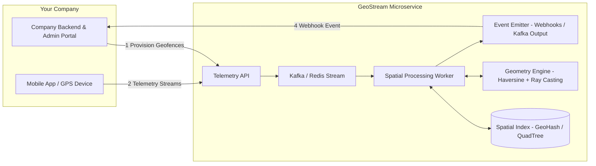

# GeoStream
### Enterprise-Grade Real-Time Geographic Geofencing & Proximity Engine

[](#)
[](#)
[](#)
[](#)

GeoStream is a production-ready, highly scalable, and stateless **Geofencing-as-a-Service (GaaS)** platform. Designed as a cloud-native microservice, it allows enterprise companies to easily add real-time geofencing capabilities to their applications without building, maintaining, or scaling complex geospatial processing infrastructure.

---

## 1. Executive Summary: What is GeoStream?

### What is GeoStream?
GeoStream is a specialized geospatial processing engine that ingests high-velocity GPS telemetry streams from mobile devices or IoT tracking hardware and automatically generates real-time geofence transition events (`GEOFENCE_ENTER`, `GEOFENCE_INSIDE`, `GEOFENCE_EXIT`).

### What Problem Does It Solve?
For organizations running location-aware applications (such as ride-hailing, fleet logistics, delivery dispatching, and asset tracking), continuously checking coordinates against virtual boundaries presents major scalability and engineering challenges:
* **The $O(N)$ Computational Bottleneck**: Comparing every coordinate to every registered geofence (linear search) leads to CPU exhaustion as device counts and geofences scale into the millions.
* **Network Reliability and Noise**: Mobile networks frequently retransmit telemetry, creating duplicates, out-of-order data, and inaccurate GPS bounces.
* **State Management**: Correctly identifying boundary entries, exits, and continuous presence requires low-latency, distributed state tracking across stateless application containers.

GeoStream resolves these issues by handling telemetry validation, spatial index lookups, geometric calculations, duplicate detection, device state tracking, and webhook delivery.

### Who Is the Target Customer?
The target customer is a **company** managing location-enabled applications, fleet vehicles, or IoT hardware. 
* **Logistics & Delivery Platforms**: To detect automatically when delivery vans enter or leave warehouses, hubs, or delivery zones.
* **Ride-Hailing Services**: To notify operations or customers when drivers reach pickup and drop-off points.
* **IoT & Asset Management**: To monitor valuable assets and trigger alerts if they exit restricted bounds.

---

## 2. Why Use GeoStream vs. Building from Scratch?

Building a production-grade geofencing engine in-house requires solving several complex infrastructure and mathematical problems:

| Challenge | Building from Scratch | Using GeoStream |
| :--- | :--- | :--- |
| **High CPU Load** | Naïve polygon checking (ray-casting) scales at $O(N)$. At 100k updates/sec against 50k fences, this requires 5 billion checks/sec, causing CPU starvation. | Evaluates candidate geofences using spatial indexes (GeoHash/QuadTree) to achieve $O(\log N)$ or $O(1)$ efficiency. |
| **Ingestion Bottlenecks** | Synchronous API lookups block the telemetry request loop, leading to timeouts during high-traffic events. | Decoupled ingest tier accepts updates immediately (HTTP 202) and delegates spatial operations to asynchronous worker pools. |
| **Geometric Edge Cases** | Vertices, horizontal polygon boundaries, and floating-point precision issues cause incorrect transitions and false alerts. | Built-in Ray-Casting algorithm with strict vertical boundary tests ($y_{\text{min}} < y \le y_{\text{max}}$) to prevent double counting. |
| **Distributed State** | Tracking device transitions across stateless containers requires complex state management and deduplication. | Stateless worker nodes leverage low-latency Redis structures for idempotency caching and device residency tracking. |

---

## 3. Integration Architecture & Business Workflow

GeoStream integrates into your existing systems without requiring modifications to your core business databases. Your mobile applications communicate directly with the telemetry endpoints, and GeoStream sends real-time webhook payloads back to your backend.

### System Integration Topology



### Example Business Workflow (Logistics Delivery)
1. **Provisioning**: A logistics company registers a circular or polygonal geofence around a "Delivery Hub" via the administrative API.
2. **Streaming**: As a delivery driver approaches the hub, their driver mobile application sends GPS updates to the Telemetry Ingestion API.
3. **Evaluation**: GeoStream verifies that the coordinate is valid, drops duplicate updates, performs a spatial lookup, and calculates whether the coordinate lies within the Delivery Hub polygon.
4. **Action**: If a state change occurs, GeoStream sends a webhook event to the company's backend:
   ```json
   { "event": "GEOFENCE_ENTER", "deviceId": "truck_45", "fenceId": "delivery_hub_zone" }
   ```
5. **Business Automation**: The logistics company’s backend receives this event, updates the shipment status to "Arrived at Hub" in their database, and alerts the warehouse loading team.

---

## 4. How GeoStream Works Internally

GeoStream separates I/O-bound telemetry ingestion from CPU-bound spatial processing. This design ensures that api nodes can accept incoming traffic spikes without being slowed down by geometry processing.

```mermaid
sequenceDiagram
    autonumber
    actor Dev as Company App / GPS Device
    participant API as Telemetry API Node
    queue Stream as Kafka / Redis Stream (telemetry-input)
    participant Worker as Spatial Processing Worker
    database Redis as Redis State Cache
    actor Backend as Company Backend Webhook
    
    Dev->>API: POST /v1/telemetry (GPS Data)
    activate API
    API->>API: Validate JSON payload structure
    API->>Stream: Publish Telemetry Event
    API-->>Dev: HTTP 202 Accepted (Immediately)
    deactivate API
    
    Stream->>Worker: Pull telemetry message (Consumer Group)
    activate Worker
    Worker->>Redis: Query short-term cache (Idempotency Check)
    Redis-->>Worker: Unique telemetry key validated
    
    Worker->>Worker: Spatial lookup (GeoHash / QuadTree match)
    
    rect rgb(240, 240, 255)
        note over Worker: Geometry Evaluation Pipeline
        Worker->>Worker: Circular Fence: Haversine distance
        Worker->>Worker: Polygonal Fence: Ray-Casting
    end
    
    Worker->>Redis: Query & Update residency state
    Redis-->>Worker: State change: OUTSIDE -> INSIDE
    
    Worker->>Backend: Post Webhook Callback (GEOFENCE_ENTER)
    deactivate Worker
```

---

## 5. System Design & Architectural Components

GeoStream is organized into modular services that scale independently:

* **Telemetry Ingestion Service**: A stateless HTTP application. It validates incoming coordinates and commits them to the ingestion stream. It does not perform spatial calculations.
* **Message Broker (Kafka / Redis Streams)**: Acts as the backpressure buffer. It buffers telemetry spikes, ensuring that workers can process coordinates at a steady rate.
* **Spatial Indexing Store**: Updates spatial partitions (GeoHashes or QuadTree cells) as geofences are created, modified, or deleted.
* **Spatial Processing Workers**: Asynchronous consumer nodes that process coordinates. They fetch data, run idempotency filters, query spatial indexes, perform calculations, and update the state store.
* **Redis State & Idempotency Store**: Tracks telemetry keys to prevent duplicate checks and stores the last known geofence relationship (inside or outside) for each device.
* **Downstream Delivery Engine**: Dispatches event payloads to webhook endpoints or publishing topics (`geofence-alerts`).

---

## 6. Functional & Non-Functional Requirements

### Functional Requirements
* **Telemetry Ingestion**: Ingest and validate GPS coordinates (`deviceId`, `latitude`, `longitude`, `timestamp`).
* **Geofence Provisioning**: Support CRUD operations for Circular (center + radius) and Polygonal (arbitrary vertices) geofences.
* **Idempotency & Reordering Check**: Discard duplicate or out-of-order coordinate packets.
* **Transition Detection**: Correctly identify and publish `GEOFENCE_ENTER`, `GEOFENCE_INSIDE`, and `GEOFENCE_EXIT` lifecycle events.
* **Webhook & Kafka Outbox**: Deliver events to registered destination webhook targets or Kafka logs.

### Non-Functional Requirements
* **API Response Time**: Ingest response latency under **10ms** via non-blocking API handlers.
* **Sub-millisecond Calculations**: Run geometric evaluations in under **1ms** per candidate geofence.
* **Stateless Operation**: Application nodes hold no state, allowing failed nodes to be replaced immediately.
* **Horizontal Scalability**: Ingestion nodes and workers can be scaled independently using Kubernetes or auto-scaling groups.
* **Twelve-Factor Compliance**: Portability through clean environment configs, pinned dependencies, and structured stdout logging.

---

## 7. Algorithms & Data Structures

### Spatial Indexing (GeoHash)
To avoid testing a GPS coordinate against every geofence in the system, GeoStream partitions the coordinate space using **GeoHashes**. 

1. The coordinate space is divided into a grid, where each cell is represented by a base-32 string (e.g., `te7u9`).
2. When a geofence is created, its boundaries are mapped to the overlapping GeoHash cells in Redis:
   ```
   SADD geofence:index:te7u9 fence_abc_123
   ```
3. When a GPS update arrives, the worker converts the coordinate into its corresponding GeoHash and queries Redis for overlapping geofences:
   ```
   SMEMBERS geofence:index:te7u9
   ```
This reduces the number of candidate geofences to evaluate from millions down to a few local candidate zones, changing the lookup complexity to $O(\log N)$ or $O(1)$.

---

### Circular Geofences (Haversine Formula)
To determine if a device is within a circular geofence, the system computes the great-circle distance over the Earth's surface between the coordinate and the geofence center:

$$\Delta \phi = \phi_2 - \phi_1,\quad \Delta \lambda = \lambda_2 - \lambda_1$$
$$a = \sin^2\left(\frac{\Delta \phi}{2}\right) + \cos(\phi_1) \cdot \cos(\phi_2) \cdot \sin^2\left(\frac{\Delta \lambda}{2}\right)$$
$$c = 2 \cdot \arctan2\left(\sqrt{a}, \sqrt{1-a}\right)$$
$$d = R \cdot c$$

If the computed distance $d \le \text{radius}$, the device is inside the geofence.

---

### Polygonal Geofences (Ray-Casting Algorithm)
For polygonal geofences, GeoStream implements the **Ray-Casting Algorithm** (based on the Jordan Curve Theorem). A horizontal ray is cast from the GPS coordinate to infinity. The system counts how many times this ray intersects the polygon's edges. An odd number of intersections indicates the point is inside the boundary; an even number indicates it is outside.

```
       +-------------------------+
       |                         |
*======|========* (Inside: 1)    |
       |                         |
       +------------+------------+
                    |
*===================|======* (Outside: 2 intersections)
                    |
                    +
```

#### Handling Edge Cases & Vertex Intersections
Naïve ray-casting implementations can suffer from floating-point errors, duplicate edge counts, and failures near boundary lines. GeoStream resolves these issues using the following techniques:

1. **Vertex Double Counting (Vertical Boundary Test)**: If the ray passes directly through a polygon vertex, it intersects two edges at once, which can skew the count. GeoStream avoids this by applying a strict vertical boundary inequality:
   $$y_{\text{min}} < y_{\text{device}} \le y_{\text{max}}$$
   This ensures that vertices located at $y_{\text{max}}$ count as intersections, while vertices at $y_{\text{min}}$ do not, preventing double counting.
2. **Horizontal Polygon Edges**: Horizontal edges ($y_1 = y_2$) are skipped during ray-casting evaluations to prevent division-by-zero errors.
3. **Floating-point Precision**: Edge crossings are calculated using high-precision calculations. The intersection x-coordinate is computed as:
   $$x_{\text{intersection}} = x_1 + \frac{(y_{\text{device}} - y_1) \cdot (x_2 - x_1)}{y_2 - y_1}$$
   If $x_{\text{device}} < x_{\text{intersection}}$, it counts as a valid intersection.

---

## 8. Geofence Lifecycle & Transitions

To avoid flooding company integrations with duplicate alerts, GeoStream manages device states and triggers webhooks only when a device crosses a geofence boundary.

```
           +----------------+
           |    OUTSIDE     |
           +---+--------^---+
               |        |
 GEOFENCE_ENTER|        | GEOFENCE_EXIT
               v        |
           +---+--------+---+
           |    INSIDE      | <---+ GEOFENCE_INSIDE
           +----------------+-----+ (periodic update)
```

* **`GEOFENCE_ENTER`**: Triggered when the device status transitions from `OUTSIDE` (or no previous record) to `INSIDE`.
* **`GEOFENCE_INSIDE`**: Triggered when the device remains inside a geofence. These updates are throttled according to your configuration to prevent unnecessary webhook volume.
* **`GEOFENCE_EXIT`**: Triggered when the device status transitions from `INSIDE` to `OUTSIDE`.

---

## 9. Developer & Integration API Documentation

### Telemetry Ingestion API
Used by your mobile application or tracking devices to send real-time coordinates.

* **Endpoint**: `POST /v1/telemetry`
* **Headers**: `Content-Type: application/json`
* **Payload Example**:
  ```json
  {
    "deviceId": "vehicle_truck_29",
    "latitude": 18.922100,
    "longitude": 72.834100,
    "timestamp": 1719878405
  }
  ```
* **Response**:
  - **Status Code**: `202 Accepted`
  - **Payload**:
    ```json
    {
      "status": "Accepted",
      "message": "Telemetry queued for spatial processing",
      "timestamp": 1719878405
    }
    ```

---

### Geofence Provisioning API
Used by your admin portal or server to manage geofences.

* **Endpoint**: `POST /v1/geofences`
* **Headers**: `Content-Type: application/json`
* **Payload Example (Circular Geofence)**:
  ```json
  {
    "fenceId": "retail_zone_south",
    "type": "CIRCULAR",
    "geometry": {
      "latitude": 19.0896,
      "longitude": 72.8656,
      "radiusMeters": 300.0
    },
    "metadata": {
      "zoneName": "Southern Plaza Hub",
      "tags": ["retail", "promo-zone"]
    }
  }
  ```
* **Payload Example (Polygonal Geofence)**:
  ```json
  {
    "fenceId": "airport_cargo_bay",
    "type": "POLYGON",
    "geometry": {
      "vertices": [
        {"latitude": 19.1150, "longitude": 72.8750},
        {"latitude": 19.1200, "longitude": 72.8900},
        {"latitude": 19.1050, "longitude": 72.8950},
        {"latitude": 19.1000, "longitude": 72.8700}
      ]
    },
    "metadata": {
      "zoneName": "Cargo Security Area A",
      "tags": ["logistics", "restricted"]
    }
  }
  ```
* **Response**:
  - **Status Code**: `201 Created`
  - **Payload**:
    ```json
    {
      "fenceId": "airport_cargo_bay",
      "status": "Active",
      "spatialIndexCells": ["te7u9", "te7ud"]
    }
    ```

---

### Webhook Event Outbox Example
GeoStream posts the following payload to your registered webhook target when a transition occurs:

```json
{
  "event": "GEOFENCE_ENTER",
  "deviceId": "vehicle_truck_29",
  "fenceId": "airport_cargo_bay",
  "telemetry": {
    "latitude": 19.112000,
    "longitude": 72.881000,
    "timestamp": 1719878410
  },
  "metadata": {
    "zoneName": "Cargo Security Area A",
    "tags": ["logistics", "restricted"]
  }
}
```

---

## 10. Configuration & Twelve-Factor Compliance

GeoStream follows the [Twelve-Factor App methodology](https://12factor.net/) to ensure environment portability and resilience.

### Environment Variables
Configure your runtime environments using these variables:

| Variable | Default Value | Purpose |
| :--- | :--- | :--- |
| `PORT` | `8080` | Port for the HTTP Telemetry API server. |
| `REDIS_URL` | `redis://localhost:6379` | URI for state, indexing, and idempotency cache. |
| `KAFKA_BROKERS` | `localhost:9092` | Comma-separated addresses of Kafka brokers. |
| `WEBHOOK_TARGET_URL`| `http://localhost:9000/callback` | Webhook URL for downstream transition alerts. |
| `MAX_GEO_PRECISION_METERS` | `10` | The precision limit for coordinate snapping. |
| `GEOHASH_PRECISION_CHARS`| `6` | Length of GeoHash keys representing the grid size. |
| `IDEMPOTENCY_TTL_SECONDS`| `3600` | Expiration window for tracking deduplicated telemetry. |

### Twelve-Factor App Compliance
* **Factor II (Dependencies)**: Explicitly declared and pinned in the package manifests (e.g., `go.mod` / `package.json`).
* **Factor III (Configuration)**: Dynamic configuration injected entirely via environment variables.
* **Factor IV (Backing Services)**: Kafka and Redis are treated as attached resources. Switching from local containers to managed cloud services (e.g. AWS MSK, AWS ElastiCache) requires only a change in environment variables.
* **Factor VI (Stateless Processes)**: Memory state is transient. Worker nodes do not store local data on disk. If a worker node crashes, it can be replaced instantly without recovery procedures.
* **Factor IX (Disposability)**: The service intercepts `SIGTERM` / `SIGINT` signals. Upon receipt, it stops accepting new work, completes processing for messages currently in flight, flushes state, closes network pools, and exits cleanly with code `0`.
* **Factor XI (Logs)**: The system writes logs strictly to standard output (`stdout`) as structured streams, allowing for collection by log collectors (such as Fluentd, Logstash, or Datadog).

---

## 11. Engineering Decisions & Design Trade-offs

### Decoupled Ingestion vs. Inline API Evaluation
* **Trade-off**: Requires running and maintaining a message broker (Kafka or Redis Streams) and introduces eventual consistency (processing delay of a few milliseconds).
* **Rationale**: Running heavy spatial calculations directly inside the HTTP request pipeline can block threads and cause timeouts during coordinate spikes. Decoupling ensures immediate telemetry acceptance (HTTP 202) and keeps the API responsive under high volumes of traffic.

### Redis Idempotency Cache vs. Relational Storage Checks
- **Trade-off**: Memory cost in Redis. Duplicate coordinates sent days apart are not caught once their keys expire from the cache.
- **Rationale**: The majority of duplicate coordinates are caused by mobile network retries, which typically happen within a few minutes. Checking keys in Redis takes less than a millisecond, preventing database write bottlenecks.

### GeoHash Grid Indexing vs. R-Tree Indexes
- **Trade-off**: GeoHashes can suffer from boundary issues, where points near grid lines may require checks against adjacent grids. R-Trees are more geometrically precise.
- **Rationale**: GeoHash lookup can be done using simple key-value structures (like Redis Sets), which makes it easy to scale horizontally. Distributed R-Tree systems require complex architectures that are harder to maintain.

---

## 12. Getting Started & Running Locally

To test GeoStream locally, ensure you have Docker and Docker Compose installed.

### 1. Project Setup
Clone the repository and copy the environment template:
```bash
git clone https://github.com/your-org/geostream.git
cd geostream
cp .env.example .env
```

### 2. Start Services
Launch the backing services (Kafka, Redis, Webhook Mock Server, and GeoStream app):
```bash
docker-compose up -d --build
```

### 3. Verify Operational Status
Ensure all containers are up and listening:
```bash
docker-compose ps
```

Monitor spatial processing logs:
```bash
docker-compose logs -f webhook-mock
```

### 4. Run Integration Tests
First, provision a geofence around a destination zone:
```bash
curl -X POST http://localhost:8080/v1/geofences \
  -H "Content-Type: application/json" \
  -d '{
    "fenceId": "gateway_of_india",
    "type": "CIRCULAR",
    "geometry": {
      "latitude": 18.9220,
      "longitude": 72.8340,
      "radiusMeters": 100.0
    },
    "metadata": {
      "zoneName": "Gateway of India Plaza",
      "tags": ["tourist-hub"]
    }
  }'
```

Next, send coordinates outside the boundary:
```bash
curl -X POST http://localhost:8080/v1/telemetry \
  -H "Content-Type: application/json" \
  -d '{
    "deviceId": "taxi_cab_45",
    "latitude": 18.9500,
    "longitude": 72.8100,
    "timestamp": 1719878401
  }'
```

Send coordinates inside the boundary to trigger a `GEOFENCE_ENTER` event:
```bash
curl -X POST http://localhost:8080/v1/telemetry \
  -H "Content-Type: application/json" \
  -d '{
    "deviceId": "taxi_cab_45",
    "latitude": 18.9221,
    "longitude": 72.8341,
    "timestamp": 1719878405
  }'
```

Check the mock webhook logs to verify the event delivery:
```bash
docker-compose logs webhook-mock
```

---

## 13. Project Directory Structure

```
geostream/
├── .env.example              # Template environment configuration file
├── docker-compose.yml        # Multi-container local execution setup
├── Dockerfile                # Multi-stage production container build schema
├── README.md                 # Project README documentation
├── cmd/
│   ├── api/                  # Telemetry Ingestion HTTP Server entrypoint
│   │   └── main.go
│   └── worker/               # Spatial Processing Worker entrypoint
│       └── main.go
├── internal/
│   ├── api/                  # Ingestion HTTP handler routes & validation
│   ├── queue/                # Kafka consumer / producer clients
│   ├── spatial/              # Spatial index (GeoHash/QuadTree) components
│   ├── geometry/             # Haversine & Ray-Casting algorithm engines
│   │   ├── geometry.go
│   │   └── geometry_test.go  # Boundary edge case validation suite
│   ├── state/                # Redis client for idempotency & device residency state
│   └── config/               # Environment parser variables loader
└── go.mod                    # Dependency locking file (Go example)
```

---

## 14. Contributing & License

### Contributing
We welcome contributions. To contribute:
1. Fork the repository.
2. Create your feature branch (`git checkout -b feature/amazing-feature`).
3. Commit your changes (`git commit -m 'Add some amazing feature'`).
4. Push to the branch (`git push origin feature/amazing-feature`).
5. Open a Pull Request.

Ensure all unit tests in `internal/geometry/geometry_test.go` pass before opening your PR.

### License
GeoStream is released under the [MIT License](LICENSE). Feel free to use, modify, and distribute it.
